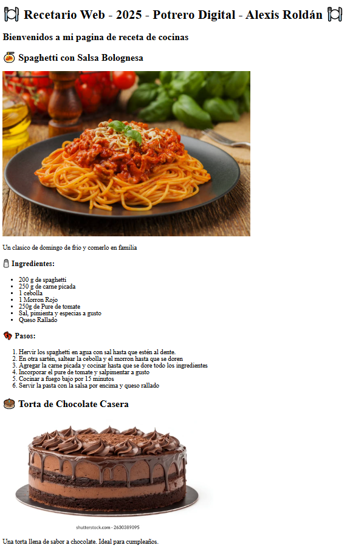

# 🍃 POTRERO DIGITAL  
## 🎨 PROGRAMACIÓN FRONTEND

---

## 📘 TAREA N°1

> ¡Bienvenido/a a tu primera tarea de Frontend! En esta actividad, trabajarás con HTML para crear contenido útil y bien estructurado.

---

### 🛠️ Instrucciones

#### 1️⃣ Crear un archivo `index.html`

> 🧾 Este será tu archivo principal donde escribirás todo el contenido.

---

#### 2️⃣ Generar la estructura básica de HTML y darle un título a la página

> 📄 No olvides incluir las etiquetas esenciales: `<!DOCTYPE html>`, `<html>`, `<head>`, `<body>`  
> 🏷️ Asegúrate de darle un título atractivo dentro de la etiqueta `<title>`.

---

#### 3️⃣ Realizar **dos recetas de cocina** que deben incluir lo siguiente:

##### 🍲 a. Nombre de la receta  
Un título llamativo para identificar qué vas a cocinar.

##### 📝 b. Una introducción a la receta  
Un pequeño párrafo que cuente algo sobre la receta: ¿de dónde es?, ¿por qué te gusta?, ¿qué la hace especial?

##### 🧂 c. Lista desordenada de los ingredientes  
Utiliza una lista `<ul>` para mostrar todos los ingredientes necesarios.  
Ejemplo:
```html
<ul>
  <li>1 taza de harina</li>
  <li>2 huevos</li>
  <li>1/2 taza de leche</li>
</ul>
```
##### 🧂 d. Lista ordenada de los pasos a seguir
 ```html
 <ol>
  <li>Mezcla los ingredientes secos.</li>
  <li>Agrega los huevos y la leche.</li>
  <li>Revuelve hasta obtener una masa homogénea.</li>
</ol>
```

---

### 🖼️ Ejemplo de vista previa:

> Así se puede ver tu receta en el navegador 👇



*Esta imagen muestra tu archivo HTML en funcionamiento dentro del navegador.*

---


